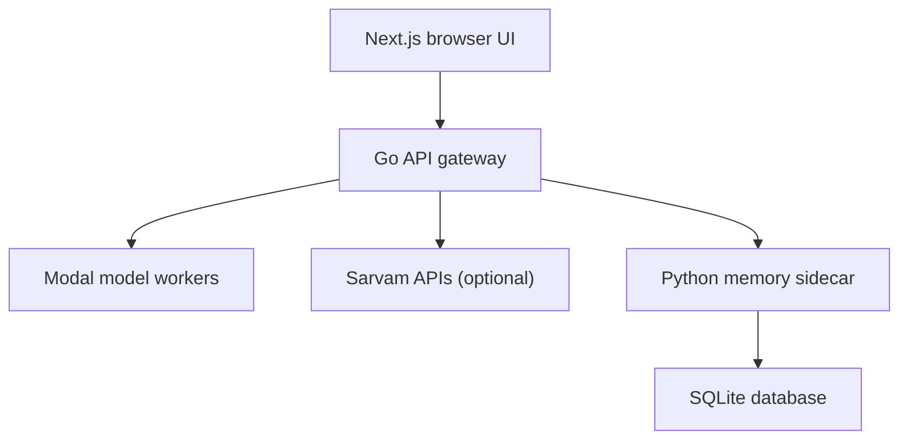

# System architecture

Awaaz is split into a browser client, a Go API gateway, external model services, and a Python memory sidecar.

## Request flow

### Chat

The browser sends chat requests to `POST /api/v1/chat`. The Go gateway validates the messages, optionally retrieves relevant memory for the latest user turn, and calls the selected model provider. Awaaz's Qwen model is the default; the Sarvam provider is available when `SARVAM_API_KEY` is configured. After a successful reply, the gateway asks the memory sidecar to observe the latest user turn in the background.

### Voice

The UI records while the user holds the talk button, converts the clip to 16 kHz mono WAV, then sends one request to `POST /api/v1/voice`. The default path runs speech recognition, a chat model, and speech synthesis. The optional full Sarvam voice path uses Sarvam for its voice pipeline. This is a request-per-turn HTTP flow; the active UI does not use a WebSocket voice room.

### Memory

The Python sidecar in `research/memory/sidecar.py` stores facts in SQLite and rebuilds its retrieval indexes when it starts. The gateway talks to it through `MEMORY_URL`, which defaults to `http://127.0.0.1:18081`. If memory is unavailable, ordinary chat can still run without recalled context. The store is currently a single-user demo store; it does not provide per-user isolation.

## Main components

| Component | Location | Responsibility |
|---|---|---|
| Browser UI | `frontend/awaaz-ui` | Chat, push-to-talk recording, playback, and the memory panel |
| Gateway | `backend/cmd/api`, `backend/internal/handler` | HTTP API, provider routing, input limits, CORS, and upstream calls |
| Model workers | Modal endpoints configured in `backend/internal/config/config.go` | Qwen chat, Whisper ASR, voice pipeline, and TTS |
| Optional provider | `backend/internal/sarvam` | Sarvam chat and voice requests |
| Memory sidecar | `research/memory` | Fact capture, retrieval, explicit forgetting, and SQLite persistence |

The Next.js server rewrites `/api/*` and `/healthz` to the gateway unless `NEXT_PUBLIC_API_URL` is set. The rewrite target is configured with `GATEWAY_URL`; see [local development](development.md).

## Deployment layout

`Dockerfile` builds the Go gateway and packages it with the Python memory sidecar. `start.sh` launches both processes in that container. Model workers remain external. `render.yaml` describes the backend service, while `frontend/awaaz-ui/vercel.json` configures the frontend build.

The deployed Render service currently uses the free plan. Its SQLite path is configured as `/data/memory.db`, but the blueprint does not attach a persistent disk, so memory can reset when the service restarts. For durable deployed memory, attach a persistent volume and point `MEMORY_DB` at that volume.
